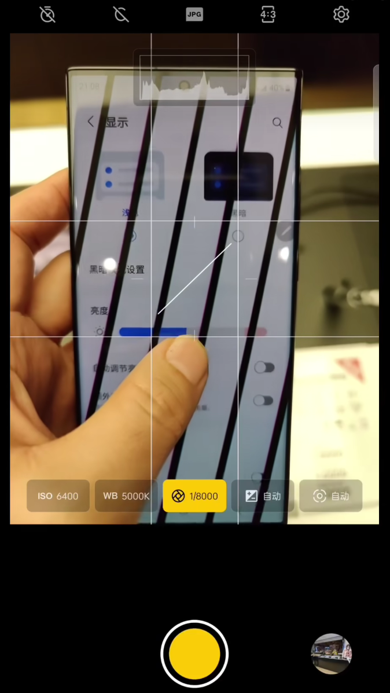
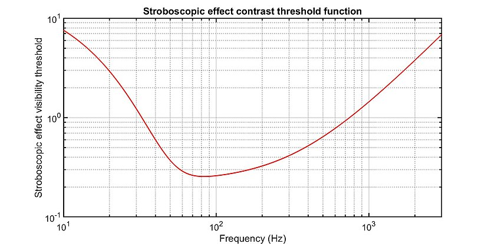
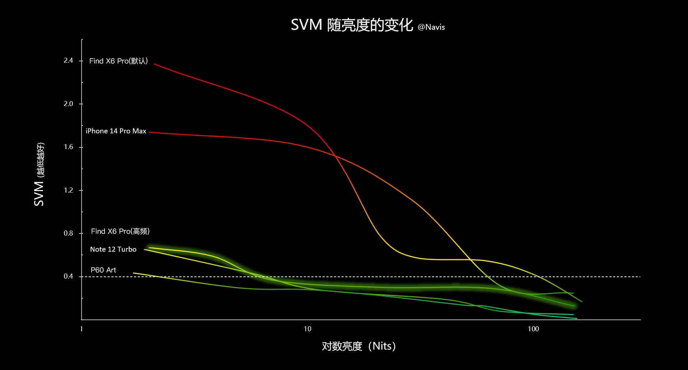
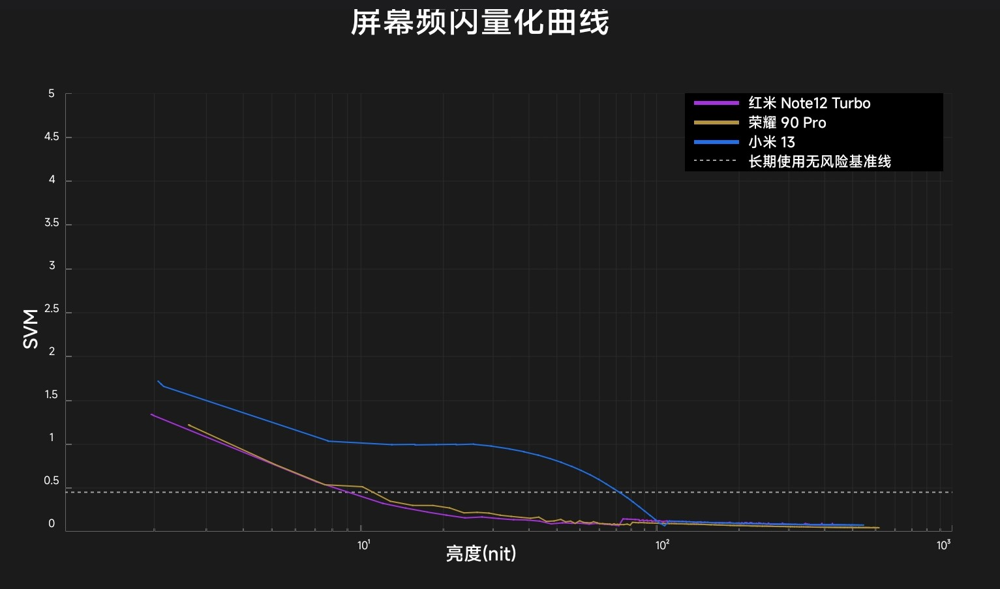

<!-- #! https://zhuanlan.zhihu.com/p/642886728

# 手机护眼概论及OLED屏幕降低频闪原理介绍

https://www.cnblogs.com/cjyyx/p/18268818
-->

# 影响护眼的因素

## 蓝光

目前手机大多已经实现硬件低蓝光，而且蓝光也可以通过护眼模式轻易克服。

## 偏振光

偏振光指振动方向与传播方向不对称的光，主要分为圆偏振光与线偏振光两种。

线偏振光测试方法为：透过偏振片看屏幕，旋转偏振片，若存在某个角度屏幕发出的光线无法透过偏振片，则是线偏振光。一些墨镜镜片、相机的cpl镜都可以作为偏振片使用。

大部分LCD屏幕是线偏振光[^6]，少部分OLED屏幕（如红米note12turbo）也是线偏振光。

2009年闫晓林等人让随机分组的测试者观看圆偏振光电视和普通液晶电视，进行分级视力和眨眼频率测试。通过分级视力变化和眨眼频率反映视疲劳程度。分析得出，当观看两种偏振光电视一段时间后，不论是儿童还是成人都会产生暂时视力下降。**圆偏振光与线偏振光相比，引起的视觉疲劳程度会小一些**。研究者推测是由于圆偏振光本身与线偏振光相比，其振动面不只限于某一固定方向，而是围绕光的前进方向转动，旋转电矢量端点描出均匀圆轨迹，这与自然光的振动面在各个方向上均匀分布是比较接近的，因而可能产生的视疲劳较轻。[^5]

在屏幕贴膜之后，线偏振光的成分会减少，因此可以作为护眼的手段。

## 眩光

眩光是一种影响视觉的机制。它是指视野中亮度分布不均匀、亮度范围变化不适宜、或者时间和空间上存在极端对比，造成人眼在观看时的不舒适之感或观察细部物体能力降低的现象。按照眩光产生的标准，可以分为直接眩光和反射眩光。

贴AR抗反射膜，可以减少反射眩光。

# 屏幕的频闪

## 频闪的度量

目前手机屏幕频闪的度量主要有两种方式，一种是用低快门时间的相机拍摄手机屏幕，观察黑色条纹；另一种是高时间分辨率的照度探头，测出屏幕上指定区域的亮度随时间变化曲线，再通过一定的公式计算出频闪效应可见性度量值（SVM, Stroboscopic effect visibility measure）。

### 相机拍摄

相机拍摄的方式相当简单，只要有一部手机，就可以观察频闪程度。具体方法为，将手机相机调到专业模式，将快门时间调到 1/4000 秒以下，对准被测手机屏幕，然后可以看到黑色条纹，如图所示。



一般来说，黑色条纹**越宽、颜色越深、越稀疏**，频闪程度越强。

### SVM 计算方法[^3]

传感器测得的照度随时间变化产生波形。将波形归一化，使时间平均值等于 1 ，得到相对照度波形，记为  $y(t)$，并进行三角傅里叶级数展开

$$
y(t) = \dfrac{a_0}{2} + \sum\limits_{m=1}^{\infty} \left[ a_m\cos\left(\dfrac{2\pi m t}{T}\right) + b_m\sin\left(\dfrac{2\pi m t}{T}\right) \right]
$$

相对照度波形的第  $m$  个傅里叶分量的相对幅度记为  $C_{m} = \sqrt{a_m^2 + b_m^2}$，频率记为  $f_{m} = \dfrac{m}{T}$。

考虑频闪效应对比度阈值函数（stroboscopic effect contrast threshold function）



记  $T_{m}$  为频率  $f_{m}$  对应的频闪效应对比度阈值函数值。


则 SVM 计算公式如下

$$
\mathrm{SVM}=\left[~\sum\limits_{m=1}^{\infty}\left(\dfrac{C_{m}}{T_{m}}\right)^{3.7}~\right]^{1/3.7}
$$

SVM 值越高，频闪程度越高。而且 SVM 值是可以进行精确计算的，因此可以把 SVM 作为频闪分析的理论依据。

观察 SVM 的计算过程，可以发现其取值**与屏幕亮度绝对值无关，只与亮度随时间变化曲线的形状有关**。

## 亮度越高，频闪越低

这个结论非常容易验证。最直接的，B站up主低调的山用相机拍摄过大量OLED屏幕，都有在高亮度下低频闪，在低亮度下高频闪的现象[^1]。

更进一步的，up主Navis-慢点评测展示了OLED手机屏幕 SVM 随屏幕亮度变化曲线[^2]。



up主先看评测制作APP先看频闪，同样展示了OLED手机屏幕 SVM 随屏幕亮度变化曲线[^4]。



因此可以得出结论，一般情况下，OLED 屏幕亮度越高，频闪越低。结合分析 SVM 计算过程得到的结论，有降低屏幕频闪的方法：**维持屏幕在高亮度，通过增加一个不透明度可调节的黑色滤镜来控制屏幕实际亮度，从而实现在低亮度下也有低频闪**，这就是通过屏幕滤镜降低手机频闪的原理。

## 屏幕滤镜的局限

之前提到，屏幕滤镜可以降低屏幕亮度，同时维持亮度随时间变化曲线的形状不变。而 SVM 只取决于亮度随时间变化曲线的形状。因此，屏幕滤镜可以让 SVM 一直处于最小值即频闪最低的同时降低屏幕亮度。

但是，真实情况并非如此。屏幕频闪由pwm调光和像素刷新共同决定。高亮度下pwm调光占主导，超低亮度下像素刷新占主导地位。这是因为超低亮度的时候pwm调光的波动不如像素刷新的波动大，120Hz 刷新率，每一次刷新就需要关闭再点亮一次像素，这个重新点亮就意味着频闪[^7]。

所以，**即使使用了屏幕滤镜，在超低亮度下也会存在 120Hz 的频闪！**

## 屏幕滤镜在安卓系统的实现

幸运的是，安卓系统给出了足够的 api，使我们能够实现屏幕滤镜。

首先，app 需要打开无障碍服务，获取显示在整个屏幕上的权限。

参考：<https://developer.android.com/guide/topics/ui/accessibility/service>

开启无障碍服务后，利用无障碍服务的上下文获取整个屏幕的窗口管理器，往窗口管理器添加纯黑色、透明度可调的视图对象，和相应的参数对象，就实现了屏幕滤镜。

将无障碍服务上下文传入下面代码的 `FilterViewManager` 对象，即可在屏幕上显示一个透明度可调的黑色滤镜。

```java
import android.content.Context;
import android.graphics.Color;
import android.graphics.PixelFormat;
import android.os.Handler;
import android.os.Looper;
import android.view.View;
import android.view.WindowManager;

public class FilterViewManager {

    private final Context context;
    private final WindowManager windowManager;
    private final WindowManager.LayoutParams layoutParams;
    private final FilterView filterView;
    /**
     * 滤镜处于开启状态，为 true
     */
    public boolean isOpen;
    private float alpha = 0f;
    private float hardwareBrightness = 0f;

    public FilterViewManager(Context c) {
        // 这里假设传入的 Context 有无障碍权限，后面的代码不对无障碍权限进行检验

        isOpen = false;
        context = c;
        windowManager = (WindowManager) context.getSystemService(Context.WINDOW_SERVICE);
        layoutParams = new WindowManager.LayoutParams();
        filterView = new FilterView(context);

        layoutParams.type = WindowManager.LayoutParams.TYPE_ACCESSIBILITY_OVERLAY;
        // width 和 height 尽可能大，从而覆盖屏幕
        layoutParams.width = 4000;
        layoutParams.height = 4000;
        layoutParams.format = PixelFormat.TRANSLUCENT;
        layoutParams.flags = WindowManager.LayoutParams.FLAG_NOT_FOCUSABLE |
                WindowManager.LayoutParams.FLAG_NOT_TOUCH_MODAL |
                WindowManager.LayoutParams.FLAG_NOT_TOUCHABLE |
                WindowManager.LayoutParams.FLAG_LAYOUT_IN_SCREEN |
                WindowManager.LayoutParams.FLAG_LAYOUT_NO_LIMITS |
                WindowManager.LayoutParams.FLAG_HARDWARE_ACCELERATED;
    }

    public void open() {
        new Handler(Looper.getMainLooper()).post(() -> {
            // 在UI线程中更新UI组件
            if (!isOpen) {
                windowManager.addView(filterView, layoutParams);
                isOpen = true;
            }
        });
    }

    public void close() {
        new Handler(Looper.getMainLooper()).post(() -> {
            // 在UI线程中更新UI组件
            if (isOpen) {
                windowManager.removeView(filterView);
                isOpen = false;
            }
        });
    }

    public float getAlpha() {
        if (isOpen) {
            return alpha;
        } else {
            return -1f;
        }
    }

    public void setAlpha(float alpha) {
        new Handler(Looper.getMainLooper()).post(() -> {
            if (isOpen) {
                float a = Math.min(1f, Math.max(0f, alpha));
                // 在UI线程中更新UI组件
                filterView.setAlpha(a);
                this.alpha = a;
            }
        });
    }

    public float getHardwareBrightness() {
        if (isOpen) {
            return hardwareBrightness;
        } else {
            return -1f;
        }
    }

    public void setHardwareBrightness(float brightness) {
        new Handler(Looper.getMainLooper()).post(() -> {
            if (isOpen) {
                float b = Math.min(1f, Math.max(0f, brightness));
                // 在UI线程中更新UI组件
                // layoutParams.screenBrightness 会覆盖系统亮度设置
                layoutParams.screenBrightness = b;
                windowManager.updateViewLayout(filterView, layoutParams);
                hardwareBrightness = b;
            }
        });
    }

    private static class FilterView extends View {

        public FilterView(Context context) {
            super(context);
            setBackgroundColor(Color.BLACK);
            setAlpha(0f);
        }

        @Override
        public void setAlpha(float alpha) {
            super.setAlpha(alpha);
            invalidate();
        }
    }
}
```


## 开源 APP：滤镜护眼防频闪

github 项目：<https://github.com/cjyyx/ScreenFilter>

对于 OLED 屏幕的手机，一般情况下，屏幕亮度越低，频闪越强。本应用控制屏幕具有较高的亮度，并通过给屏幕添加一层不透明度可调的黑色滤镜来调节实际亮度，从而实现**低亮度下也有低频闪**的效果。

注意：

1. 支持直接拖动系统状态栏亮度条来控制亮度
2. 当环境光照较高时，应用会自动关闭屏幕滤镜并打开系统自动亮度，从而使屏幕能够达到最大激发亮度
3. 最低支持版本安卓10
4. 本应用在开发时没有考虑兼容性，目前只能保证在我的手机上正常运行。我的手机系统是 MIUI14
5. 开启滤镜时不要开启系统纸质护眼，否则会造成花屏

下载链接 1：github release
<https://github.com/cjyyx/ScreenFilter/releases>

下载链接 2：123云盘
<https://www.123pan.com/s/Be4Hjv-fUUtv.html>


[^1]: 低调的山, <https://space.bilibili.com/394790691>
[^2]: Navis-慢点评测, <https://space.bilibili.com/8986182>
[^3]: 维基百科, <https://en.wikipedia.org/wiki/Stroboscopic_effect>
[^4]: 先看频闪, <https://www.bilibili.com/video/BV1K14y1D7mg>
[^5]: 张平奇,王丹,吕振华,等.健康显示的影响因素综述[J].液晶与显示,2020,35(09):981-990.
[^6]: 圆偏振光和线偏振光测试, <https://www.bilibili.com/video/BV15n4y1R7pp>
[^7]: 像素刷新稀释, <https://www.bilibili.com/opus/781396590214512640>
