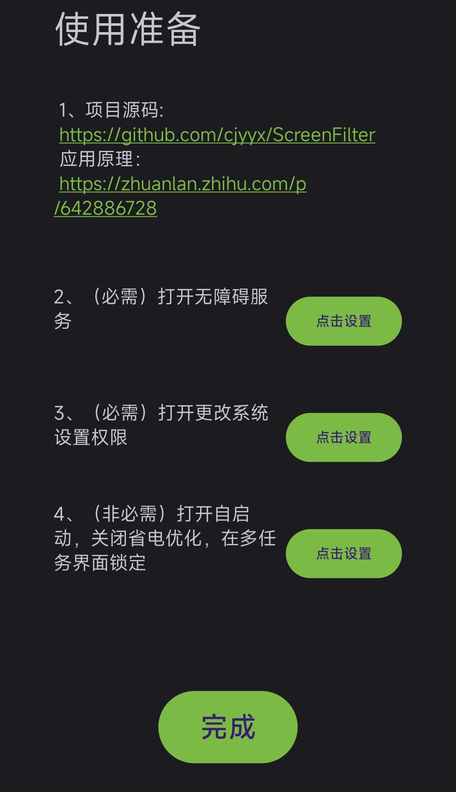

# 滤镜护眼防频闪

## 应用简介

对于 OLED 屏幕的手机，一般情况下，屏幕亮度越低，频闪越强。本应用控制屏幕具有较高的亮度，并通过给屏幕添加一层不透明度可调的黑色滤镜来调节实际亮度，从而实现**低亮度下也有低频闪**的效果。

注意：

1. 支持直接拖动系统状态栏亮度条来控制亮度
2. 当环境光照较高时，应用会自动关闭屏幕滤镜并打开系统自动亮度，从而使屏幕能够达到最大激发亮度
3. 最低支持版本安卓11
4. 本应用在开发时没有考虑兼容性，目前只能保证在我的手机上正常运行。我的手机系统是 MIUI14
5. 开启滤镜时不要开启系统纸质护眼，否则会造成花屏

本应用参考了开源项目 https://github.com/helloklf/ScreenFilter

## 下载地址

下载链接 1：github release

https://github.com/cjyyx/ScreenFilter/releases

下载链接 2：123云盘

https://www.123pan.com/s/Be4Hjv-fUUtv.html

## 应用截图

## 应用原理

详见 https://zhuanlan.zhihu.com/p/642886728

## 应用使用说明

- 屏幕滤镜开关：打开关闭屏幕滤镜；注意开启滤镜时不要开启系统纸质护眼，否则会造成花屏；支持状态栏快捷设置磁贴
- 智能亮度开关：打开关闭智能亮度；控制屏幕实际亮度处于 [ 通过环境光照和亮度-光照曲线计算得的屏幕亮度 - 亮度调高容差, 通过环境光照和亮度-光照曲线计算得的屏幕亮度 + 亮度调低容差 ] 这个区间；支持状态栏快捷设置磁贴
- 正常截屏：状态栏快捷设置磁贴，关闭屏幕滤镜截图，之后恢复屏幕滤镜
- 在多任务界面隐藏：字面意思
- 屏幕亮度设置：与系统状态栏亮度条同步
- 亮光模式阈值：当环境光照超过阈值时，应用会自动关闭屏幕滤镜并打开系统自动亮度，从而使屏幕能够达到最大激发亮度
- 暗光模式阈值：当环境光照低于阈值且屏幕亮度设置条（系统状态栏亮度条）被拖到最低时，设置屏幕亮度为最低值，即系统屏幕亮度为最低硬件亮度，滤镜不透明度为最高滤镜不透明度，屏幕实际亮度 = 最低硬件亮度 * ( 1 - 最高滤镜不透明度 )^2
- 最低硬件亮度：最低硬件亮度应设置为手机屏幕关闭类 DC 调光的阈值
- 最高滤镜不透明度：可以调为暗光模式下最舒适的屏幕亮度
- 亮度调高容差：与智能亮度调节有关
- 亮度调低容差：与智能亮度调节有关
- 亮度-光照曲线设置界面：可以通过增减修改光照-亮度对应点来调整亮度-光照曲线

## 项目依赖

使用了 androidplot 库, https://github.com/halfhp/androidplot

## 项目开发

可以直接用 Android Studio 打开项目。开发时使用的是 2022.2.1 版。

## 项目各模块简介

### GlobalStatus

使项目各模块解耦合。当一个模块要调用另一个模块的方法时，必须通过 GlobalStatus

### AppConfig

管理应用的配置

### Utils

通用的工具

### UI

与应用 UI 有关

### FilterViewManager

应用的核心模块，负责管理屏幕滤镜

### AppAccessibilityService

无障碍服务，用户启用无障碍功能时被创建

### BrightnessManager

实现光照控制亮度逻辑

光照-亮度对应点 (光照强度{[0,+inf] lux}, 屏幕亮度{[0,1]})

### QuickSetting

与状态栏磁贴服务有关的模块位于 quicksetting 文件夹下
