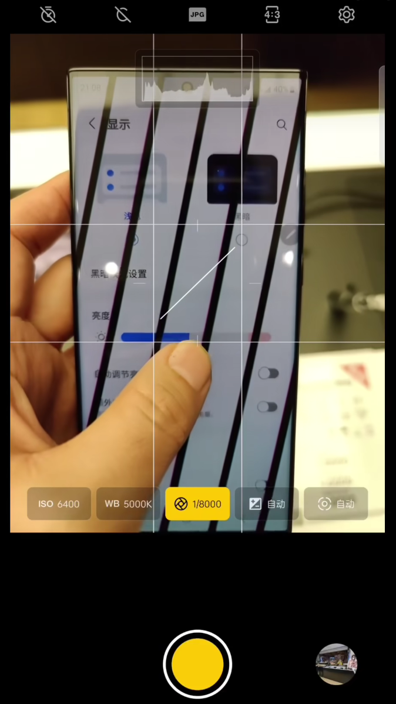

#! https://zhuanlan.zhihu.com/p/642886728
# OLED 手机降低频闪原理介绍

## 频闪的度量

目前手机屏幕频闪的度量主要有两种方式，一种是用低快门时间的相机拍摄手机屏幕，观察黑色条纹；另一种是高时间分辨率的照度探头，测出屏幕上指定区域的亮度随时间变化曲线，再通过一定的公式计算出频闪效应可见性度量值（SVM, Stroboscopic effect visibility measure）。

### 相机拍摄

相机拍摄的方式相当简单，只要有一部手机，就可以观察频闪程度。具体方法为，将手机相机调到专业模式，将快门时间调到 1/4000 秒以下，对准被测手机屏幕，然后可以看到黑色条纹，如图所示



一般来说，黑色条纹**越宽、颜色越深、越稀疏**，频闪程度越强。

### SVM 计算方法

传感器测得的照度随时间变化产生波形。将波形归一化，使时间平均值等于 1 ，得到相对照度波形，记为  $y(t)$，并进行三角傅里叶级数展开

$$
y(t) = \dfrac{a_0}{2} + \sum\limits_{m=1}^{\infty} \left( a_m\cos\left(\dfrac{2\pi m t}{T}\right) + b_m\sin\left(\dfrac{2\pi m t}{T}\right) \right)
$$

相对照度波形的第  $m$  个傅里叶分量的相对幅度记为  $C_{m} = \sqrt{a_m^2 + b_m^2}$，频率记为  $f_{m} = \dfrac{m}{T}$。

考虑频闪效应对比度阈值函数（stroboscopic effect contrast threshold function）


记  $T_{m}$  为频率  $f_{m}$  对应的频闪效应对比度阈值函数值。


则 SVM 计算公式如下

$$
SVM=\sqrt[3.7]{\sum\limits_{m=1}^{\infty}\left(\dfrac{C_{m}}{T_{m}}\right)^{3.7}}
$$

SVM 值越高，频闪程度越高。而且 SVM 值是可以进行精确计算的，因此可以把 SVM 作为频闪分析的理论依据。

观察 SVM 的计算过程，可以发现其取值**与屏幕亮度绝对值无关，只与亮度随时间变化曲线的形状有关**。

## 亮度越高，频闪越低

这个结论非常容易验证。最直接的，B站 up 主低调的山用相机拍摄过大量 OLED 屏幕，都有在高亮度下低频闪，在低亮度下高频闪的现象。

更进一步的，up 主 Navis-慢点评测展示了 OLED 手机屏幕 SVM 随屏幕亮度变化曲线


因此可以得出结论，一般情况下，OLED 屏幕亮度越高，频闪越低。结合分析 SVM 计算过程得到的结论，有降低屏幕频闪的方法：**维持屏幕在高亮度，通过增加一个不透明度可调节的黑色滤镜来控制屏幕实际亮度，从而实现在低亮度下也有低频闪**，这就是通过屏幕滤镜降低手机频闪的原理。

## 屏幕滤镜在安卓系统的实现

幸运的是，安卓系统给出了足够的 api，使我们能够实现屏幕滤镜。

首先，app 需要打开无障碍服务，获取显示在整个屏幕上的权限。

参考： https://developer.android.com/guide/topics/ui/accessibility/service

开启无障碍服务后，利用无障碍服务的上下文获取整个屏幕的窗口管理器，往窗口管理器添加纯黑色、透明度可调的视图对象，和相应的参数对象，就实现了屏幕滤镜。

将无障碍服务上下文传入下面代码的 `FilterViewManager` 对象，即可在屏幕上显示一个透明度可调的黑色滤镜。

```java
import android.content.Context;
import android.graphics.Color;
import android.graphics.PixelFormat;
import android.os.Handler;
import android.os.Looper;
import android.view.View;
import android.view.WindowManager;

public class FilterViewManager {

    private final Context context;
    private final WindowManager windowManager;
    private final WindowManager.LayoutParams layoutParams;
    private final FilterView filterView;
    /**
     * 滤镜处于开启状态，为 true
     */
    public boolean isOpen;
    private float alpha = 0f;
    private float hardwareBrightness = 0f;

    public FilterViewManager(Context c) {
        // 这里假设传入的 Context 有无障碍权限，后面的代码不对无障碍权限进行检验

        isOpen = false;
        context = c;
        windowManager = (WindowManager) context.getSystemService(Context.WINDOW_SERVICE);
        layoutParams = new WindowManager.LayoutParams();
        filterView = new FilterView(context);

        layoutParams.type = WindowManager.LayoutParams.TYPE_ACCESSIBILITY_OVERLAY;
        // width 和 height 尽可能大，从而覆盖屏幕
        layoutParams.width = 4000;
        layoutParams.height = 4000;
        layoutParams.format = PixelFormat.TRANSLUCENT;
        layoutParams.flags = WindowManager.LayoutParams.FLAG_NOT_FOCUSABLE |
                WindowManager.LayoutParams.FLAG_NOT_TOUCH_MODAL |
                WindowManager.LayoutParams.FLAG_NOT_TOUCHABLE |
                WindowManager.LayoutParams.FLAG_LAYOUT_IN_SCREEN |
                WindowManager.LayoutParams.FLAG_LAYOUT_NO_LIMITS |
                WindowManager.LayoutParams.FLAG_HARDWARE_ACCELERATED;
    }

    public void open() {
        new Handler(Looper.getMainLooper()).post(() -> {
            // 在UI线程中更新UI组件
            if (!isOpen) {
                windowManager.addView(filterView, layoutParams);
                isOpen = true;
            }
        });
    }

    public void close() {
        new Handler(Looper.getMainLooper()).post(() -> {
            // 在UI线程中更新UI组件
            if (isOpen) {
                windowManager.removeView(filterView);
                isOpen = false;
            }
        });
    }

    public float getAlpha() {
        if (isOpen) {
            return alpha;
        } else {
            return -1f;
        }
    }

    public void setAlpha(float alpha) {
        new Handler(Looper.getMainLooper()).post(() -> {
            if (isOpen) {
                float a = Math.min(1f, Math.max(0f, alpha));
                // 在UI线程中更新UI组件
                filterView.setAlpha(a);
                this.alpha = a;
            }
        });
    }

    public float getHardwareBrightness() {
        if (isOpen) {
            return hardwareBrightness;
        } else {
            return -1f;
        }
    }

    public void setHardwareBrightness(float brightness) {
        new Handler(Looper.getMainLooper()).post(() -> {
            if (isOpen) {
                float b = Math.min(1f, Math.max(0f, brightness));
                // 在UI线程中更新UI组件
                // layoutParams.screenBrightness 会覆盖系统亮度设置
                layoutParams.screenBrightness = b;
                windowManager.updateViewLayout(filterView, layoutParams);
                hardwareBrightness = b;
            }
        });
    }

    private static class FilterView extends View {

        public FilterView(Context context) {
            super(context);
            setBackgroundColor(Color.BLACK);
            setAlpha(0f);
        }

        @Override
        public void setAlpha(float alpha) {
            super.setAlpha(alpha);
            invalidate();
        }
    }
}
```
## 我开发的开源 APP——滤镜护眼防频闪

应用简介：

对于 OLED 屏幕的手机，一般情况下，屏幕亮度越低，频闪越强。本应用控制屏幕具有较高的亮度，并通过给屏幕添加一层不透明度可调的黑色滤镜来调节实际亮度，从而实现**低亮度下也有低频闪**的效果。

项目源码： https://github.com/cjyyx/ScreenFilter

下载链接： https://github.com/cjyyx/ScreenFilter/releases

注意：

1. 支持直接拖动系统状态栏亮度条来控制亮度
2. 当环境光照较高时，应用会自动关闭屏幕滤镜并打开系统自动亮度，从而使屏幕能够达到最大激发亮度
3. 最低支持版本安卓11

## 参考资料

[1] 低调的山, https://space.bilibili.com/394790691

[2] Navis-慢点评测, https://space.bilibili.com/8986182

[3] 维基百科, https://en.wikipedia.org/wiki/Stroboscopic_effect