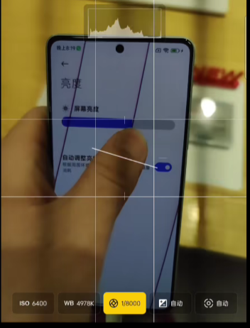
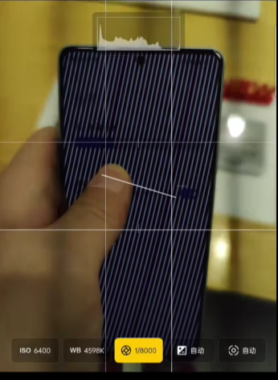
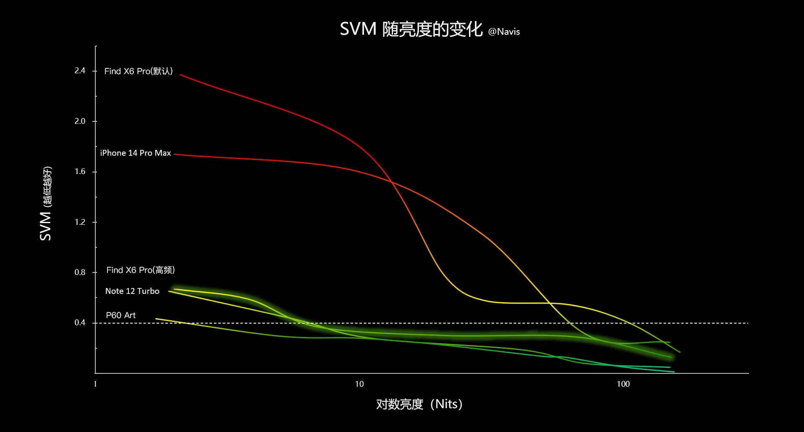
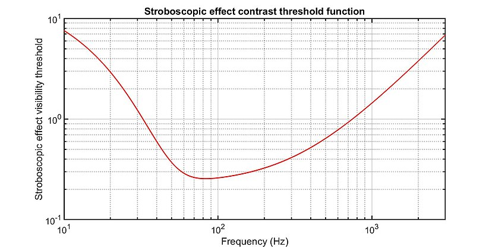

#! https://zhuanlan.zhihu.com/p/642886728
# 屏幕滤镜app——夜间防频闪

为解决 OLED 屏幕手机频闪问题，我开发了这款 app。

项目源码： https://github.com/cjyyx/ScreenFilter

下载链接： https://github.com/cjyyx/ScreenFilter/releases

## 软件原理

### 亮度越高，频闪越低

B站 up 主低调的山用相机拍摄到，OLED 屏幕在高亮度下低频闪，在低亮度下高频闪。



up 主 Navis-慢点评测展示了 OLED 手机屏幕频闪效应可见性度量值（SVM, Stroboscopic effect visibility measure）随屏幕亮度变化曲线



因此可以得出结论，一般情况下，OLED 屏幕亮度越高，频闪越低。

### SVM 计算方法

传感器测得的照度随时间变化产生波形。将波形归一化，使时间平均值等于 1 ，得到相对照度波形，记为  $y(t)$，并进行三角傅里叶级数展开

$$
y(t) = \dfrac{a_0}{2} + \sum\limits_{m=1}^{\infty} \left( a_m\cos\left(\dfrac{2\pi m t}{T}\right) + b_m\sin\left(\dfrac{2\pi m t}{T}\right) \right)
$$

相对照度波形的第  $m$  个傅里叶分量的相对幅度记为  $C_{m} = \sqrt{a_m^2 + b_m^2}$，频率记为  $f_{m} = \dfrac{m}{T}$。

考虑频闪效应对比度阈值函数（stroboscopic effect contrast threshold function）



记  $T_{m}$  为频率  $f_{m}$  对应的频闪效应对比度阈值函数值。


则 SVM 计算公式如下

$$
SVM=\sqrt[3.7]{\sum\limits_{m=1}^{\infty}\left(\dfrac{C_{m}}{T_{m}}\right)^{3.7}}
$$

观察 SVM 的计算过程，可以发现其取值与屏幕亮度绝对值无关。因此有降低屏幕频闪的方法：**维持屏幕在高亮度，通过增加一个不透明度可调节的黑色滤镜来控制屏幕实际亮度，从而实现在低亮度下也有低频闪**。

### 屏幕滤镜在安卓系统的实现

app 需要在整个屏幕上添加一层屏幕滤镜，因此需要无障碍服务。

参考： https://developer.android.com/guide/topics/ui/accessibility/service

开启无障碍服务后，将上下文传入如下对象

```java
import android.content.Context;
import android.graphics.Color;
import android.graphics.PixelFormat;
import android.os.Handler;
import android.os.Looper;
import android.view.View;
import android.view.WindowManager;

public class FilterViewManager {

    private final Context context;
    private final WindowManager windowManager;
    private final WindowManager.LayoutParams layoutParams;
    private final FilterView filterView;
    /**
     * 滤镜处于开启状态，为 true
     */
    public boolean isOpen;
    private float alpha = 0f;
    private float hardwareBrightness = 0f;

    public FilterViewManager(Context c) {
        // 这里假设传入的 Context 有无障碍权限，后面的代码不对无障碍权限进行检验

        isOpen = false;
        context = c;
        windowManager = (WindowManager) context.getSystemService(Context.WINDOW_SERVICE);
        layoutParams = new WindowManager.LayoutParams();
        filterView = new FilterView(context);

        layoutParams.type = WindowManager.LayoutParams.TYPE_ACCESSIBILITY_OVERLAY;
        // width 和 height 尽可能大，从而覆盖屏幕
        layoutParams.width = 1800;
        layoutParams.height = 3200;
        layoutParams.format = PixelFormat.TRANSLUCENT;
        layoutParams.flags = WindowManager.LayoutParams.FLAG_NOT_FOCUSABLE |
                WindowManager.LayoutParams.FLAG_NOT_TOUCH_MODAL |
                WindowManager.LayoutParams.FLAG_NOT_TOUCHABLE |
                WindowManager.LayoutParams.FLAG_LAYOUT_IN_SCREEN |
                WindowManager.LayoutParams.FLAG_LAYOUT_NO_LIMITS |
                WindowManager.LayoutParams.FLAG_HARDWARE_ACCELERATED;
    }

    public void open() {
        new Handler(Looper.getMainLooper()).post(() -> {
            // 在UI线程中更新UI组件
            if (!isOpen) {
                windowManager.addView(filterView, layoutParams);
                isOpen = true;
            }
        });
    }

    public void close() {
        new Handler(Looper.getMainLooper()).post(() -> {
            // 在UI线程中更新UI组件
            if (isOpen) {
                windowManager.removeView(filterView);
                isOpen = false;
            }
        });
    }

    public float getAlpha() {
        if (isOpen) {
            return alpha;
        } else {
            return -1f;
        }
    }

    public void setAlpha(float alpha) {
        new Handler(Looper.getMainLooper()).post(() -> {
            if (isOpen) {
                float a = Math.min(1f, Math.max(0f, alpha));
                // 在UI线程中更新UI组件
                filterView.setAlpha(a);
                this.alpha = a;
            }
        });
    }

    public float getHardwareBrightness() {
        if (isOpen) {
            return hardwareBrightness;
        } else {
            return -1f;
        }
    }

    public void setHardwareBrightness(float brightness) {
        new Handler(Looper.getMainLooper()).post(() -> {
            if (isOpen) {
                float b = Math.min(1f, Math.max(0f, brightness));
                // 在UI线程中更新UI组件
                // layoutParams.screenBrightness 会覆盖系统亮度设置
                layoutParams.screenBrightness = b;
                windowManager.updateViewLayout(filterView, layoutParams);
                hardwareBrightness = b;
            }
        });
    }

    private static class FilterView extends View {

        public FilterView(Context context) {
            super(context);
            setBackgroundColor(Color.BLACK);
            setAlpha(0f);
        }

        @Override
        public void setAlpha(float alpha) {
            super.setAlpha(alpha);
            invalidate();
        }
    }
}
```

之后调用 `FilterViewManager` 即可调整屏幕亮度和滤镜不透明度。

## 软件功能

如上所述，app 可以维持屏幕在高亮度，通过滤镜的方式调整屏幕实际亮度，从而实现低亮度下低频闪。

此外，app 也会监测环境光照，实现智能调整屏幕亮度。app 也支持自定义屏幕亮度调整逻辑。当环境光照过强时，app 会自动关闭滤镜，打开系统自动亮度，使屏幕能够达到最大激发亮度。


## 参考资料

[1] 低调的山, https://space.bilibili.com/394790691
[2] Navis-慢点评测, https://space.bilibili.com/8986182
[3] 维基百科, https://en.wikipedia.org/wiki/Stroboscopic_effect